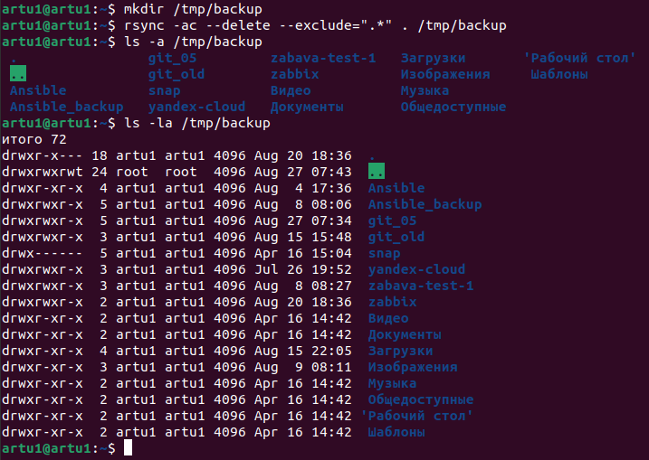
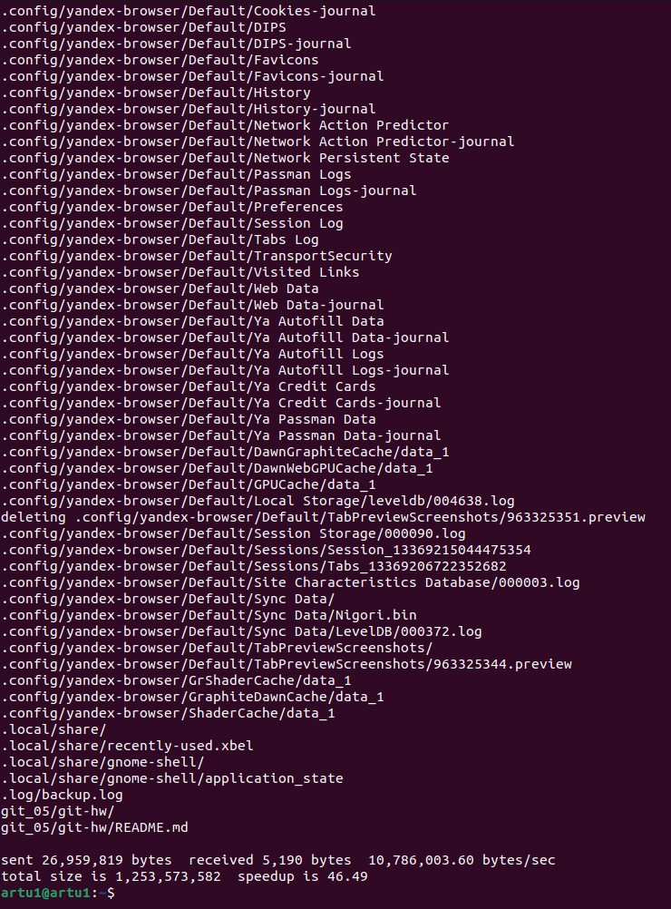

# Домашнее задание к занятию "Резервное копирование" - Артем Пестроухов

### Задание 1
- Составьте команду rsync, которая позволяет создавать зеркальную копию домашней директории пользователя в директорию `/tmp/backup`
- Необходимо исключить из синхронизации все директории, начинающиеся с точки (скрытые)
- Необходимо сделать так, чтобы rsync подсчитывал хэш-суммы для всех файлов, даже если их время модификации и размер идентичны в источнике и приемнике.
- На проверку направить скриншот с командой и результатом ее выполнения

### Решение 1



---

### Задание 2
- Написать скрипт и настроить задачу на регулярное резервное копирование домашней директории пользователя с помощью rsync и cron.
- Резервная копия должна быть полностью зеркальной
- Резервная копия должна создаваться раз в день, в системном логе должна появляться запись об успешном или неуспешном выполнении операции
- Резервная копия размещается локально, в директории `/tmp/backup`
- На проверку направить файл crontab и скриншот с результатом работы утилиты.

### Решение 2

Выдержка из crontab:

```
0 6-22 * * * /home/artu1/backup_home #команда запускается ежедневно, кроме ночного времени
```

Написанный скрипт:

```
#!/bin/bash

rsync -av --delete /home/artu1/ /tmp/backup >> /home/artu1/.log/backup.log 2>&1 #поставлен флаг verbose
                                                                                #для отображения изменённых
if [ "$?" -eq 0 ]; then                                                         #за день файлов в логе
	logger "Backup success"
else
	logger "Backup fail"
fi
```


```
cat /home/artu1/.log/backup.log
```


